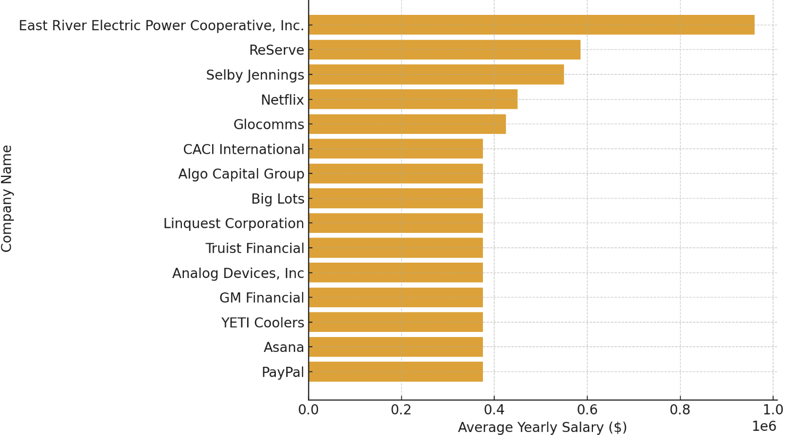

# Introduction
Welcome to my SQL Portfolio Project, where I delve into the data job market with a focus on data science roles. This project is a personal exploration into identifying the top-paying jobs, in-demand skills, and the intersection of high demand with high salary in the field of data analytics.

Check out my SQL queries here: [project_sql](https://github.com/s8korto/SQL_Project_Data_Job_Analysis/tree/main/project_sql).

# Background
The motivation behind this project stemmed from my desire to understand the data science job market better. I aimed to discover which skills are paid the most and in demand, making my job search more targeted and effective. 

The questions I wanted to answer through my SQL queries were:

1. What are the top-paying data analyst jobs?
2. What skills are required for these top-paying jobs?
3. What skills are most in demand for data analysts?
4. Which skills are associated with higher salaries?
   
# Tools I Used
In this project, I utilized a variety of tools to conduct my analysis:

- **SQL** (Structured Query Language): Enabled me to interact with the database, extract insights, and answer my key questions through queries.
- **PostgreSQL**: As the database management system, PostgreSQL allowed me to store, query, and manipulate the job posting data.
- **Visual Studio Code:** This open-source administration and development platform helped me manage the database and execute SQL queries.

# The Analysis
Each query for this project aimed at investigating specific aspects of the data science job market. Here’s how I approached each question:

### 1. Top Paying Data Science Jobs
To identify the highest-paying roles, I filtered data science positions by average yearly salary and location. This query highlights the high paying opportunities in the field.
```sql
SELECT 
    job_postings_fact.job_id,
    company_dim.name AS company_name,
    job_postings_fact.job_title,
    job_postings_fact.job_location,
    job_postings_fact.job_schedule_type,
    job_postings_fact.salary_year_avg,
    job_postings_fact.job_posted_date
FROM 
    job_postings_fact
LEFT JOIN company_dim 
    ON job_postings_fact.company_id = company_dim.company_id
WHERE 
    job_postings_fact.salary_year_avg IS NOT NULL 
    AND job_postings_fact.job_title_short = 'Data Scientist'
ORDER BY 
    job_postings_fact.salary_year_avg DESC
LIMIT 15;
```
Here's the breakdown of the top data science jobs in 2023:
- **Wide Salary Range:** Top 15 paying data science roles span from $390,000 to $960,000, indicating significant salary potential in the field.
- **Diverse Employers:** Companies like East River Electric Power Cooperative, ReServe, and Selby Jennings are among those offering high salaries, showing a broad interest across different industries.


*Bar graph visualizing the salary for the top 15 salaries for data science; ChatGPT generated this graph from my SQL query results*


# What I Learned
# Conclusions
